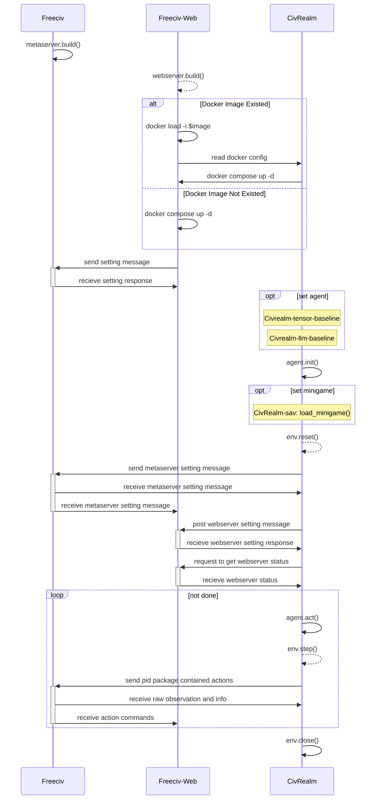

# Frame

```mermaid
sequenceDiagram
    Freeciv ->> Freeciv : metaserver.build()
    Freeciv-Web -->> Freeciv-Web : webserver.build()
    alt Docker Image Existed
        Freeciv-Web->>Freeciv-Web: docker load -i $image
        Freeciv-Web ->> CivRealm : read docker config
        CivRealm ->> Freeciv-Web : docker compose up -d
    else Docker Image Not Existed
        Freeciv-Web->>Freeciv-Web: docker compose up -d
    end
    Freeciv-Web ->> + Freeciv : send setting message
    Freeciv ->> - Freeciv-Web : recieve setting response
    opt set agent
        Note over CivRealm : Civrealm-tensor-baseline
        Note over CivRealm : Civrealm-llm-baseline
    end
    CivRealm ->> CivRealm : agent.init()
    opt set minigame
        Note over CivRealm : CivRealm-sav: load_minigame()
    end
    CivRealm -->> CivRealm : env.reset()
        CivRealm ->> + Freeciv : send metaserver setting message
        Freeciv ->>  CivRealm : receive metaserver setting message
        Freeciv ->> - Freeciv-Web : receive metaserver setting message
        CivRealm ->> + Freeciv-Web : post webserver setting message
        Freeciv-Web ->> - CivRealm : recieve webserver setting response
        CivRealm ->> + Freeciv-Web : request to get webserver status
        Freeciv-Web ->> - CivRealm : recieve webserver status
    loop not done
        CivRealm ->> CivRealm : agent.act()
        CivRealm -->> CivRealm : env.step()
        CivRealm ->> + Freeciv : send pid package contained actions
        Freeciv ->>   CivRealm : receive raw observation and info
        Freeciv ->> - Freeciv-Web : receive action commands
    end
    CivRealm ->> CivRealm : env.close()

```
