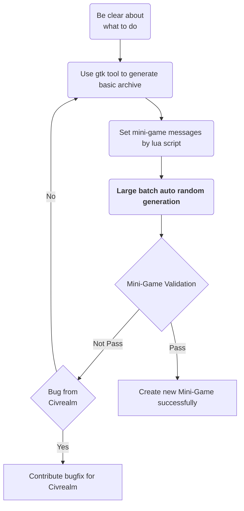

# Mini-Game

Due to the multifaceted aspects of a full game, including economic expansion, military development, diplomatic negotiations, cultural construction, and technological research, we have devised mini games to address each component individually. Each mini-game is designed with specific objectives, varying difficulty levels, step-based rewards, and an overall game score. The designed details could be found in the [paper](https://openreview.net/forum?id=UBVNwD3hPN).

By the end of this tutorial, you will be able to

* Understand the basic setting of mini-game
* Initialize mini-game by using API for random initialization or manual specification
* Create a new mini-game by yourself

## 🎮 Setting
### 🏁 Game Status

To describe whether a mini-game is over, the game-ending conditions include:

* The game score being greater than or equal to the goal score
* Reaching the maximum number of rounds set for the game

The enumerated values are as follows:
```python title="src/civrealm/envs/freeciv_minitask_env.py"
@unique
class MinitaskGameStatus(ExtendedEnum):
    MGS_END_GAME = 1
    MGS_IN_GAME = 0
```

### 🔥 Game Difficulty
Based on the richness of terrain resources, the comparison of unit quantities, and other information, we designed the difficulty level of the mini-game.

The enumerated values are as follows:
```python title="src/civrealm/envs/freeciv_minitask_env.py"
@unique
class MinitaskDifficulty(ExtendedEnum):
    MD_EASY = 'easy'
    MD_NORMAL = 'normal'
    MD_HARD = 'hard'
```

### 🏆 Victory Status

In the mini-game, the player’s current victory status can be represented as: failure, success, and unknown. The unknown state signifies that the game has not yet concluded, while the determination of failure and success only occurs after the game ends.

The enumerated values are as follows:
```python title="src/civrealm/envs/freeciv_minitask_env.py"
@unique
class MinitaskPlayerStatus(ExtendedEnum):
    MPS_SUCCESS = 1
    MPS_FAIL = 0
    MPS_UNKNOWN = -1
```
### 🗺️ Supported Types

We have designed the following 10 types of mini-games:

<table>
    <tr> 
        <td bgcolor="Lavender"><b>Category</b></td>
        <td bgcolor="Lavender"><b>ID</b></td>
        <td bgcolor="Lavender"><b>Name</b></td>
        <td bgcolor="Lavender"><b>Introduction</b></td>
    </tr>
    <tr> 
        <td rowspan="4">Development</td>
        <td>1</td>
        <td>development_build_city</td>
        <td>Move settler to suitable areas for building a city.</td>
    </tr>
    <tr> 
        <td>2</td>
        <td>development_build_infra</td>
        <td>Command workers to build infrastructures for improving cities.</td>
    </tr>
    <tr> 
        <td>3</td>
        <td>development_citytile_wonder</td>
        <td>Arrange work tiles to speed up producing a world wonder.</td>
    </tr>
    <tr> 
        <td>4</td>
        <td>development_transport</td>
        <td>Transport settlers by ships to another continent and build cities.</td>
    </tr>
    <tr> 
        <td rowspan="5">Battle</td>
        <td>5</td>
        <td>battle_[ancient_era,industry_era,<br>info_era,medieval,modern_era]</td>
        <td>Defeat enemy units on land tiles (units from various ages).</td>
    </tr>
    <tr> 
        <td>6</td>
        <td>battle_attack_city</td>
        <td>Conquer an enemy city.</td>
    </tr>
    <tr> 
        <td>7</td>
        <td>battle_defend_city</td>
        <td>Against enemy invasion for a certain number of turns.</td>
    </tr>
    <tr> 
        <td>8</td>
        <td>battle_naval</td>
        <td>Defeat enemy fleet on the ocean (with Middle Times frigates).</td>
    </tr>
    <tr> 
        <td>9</td>
        <td>battle_naval_modern</td>
        <td>Defeat enemy fleet on the ocean (with several classes of modern ships).</td>
    </tr>
    <tr> 
        <td>Diplomacy</td>
        <td>10</td>
        <td>diplomacy_trade_tech</td>
        <td>Trade technologies with another civilization.</td>
    </tr>

</table>

The enumerated values are as follows:
```python title="src/civrealm/envs/freeciv_minitask_env.py"
@unique
class MinitaskType(ExtendedEnum):
    MT_DEVELOPMENT_BUILD_CITY = "development_build_city"
    MT_DEVELOPMENT_CITYTILE_WONDER = "development_citytile_wonder"
    MT_DEVELOPMENT_BUILD_INFRA = "development_build_infra"
    MT_DEVELOPMENT_TRANSPORT = "development_transport"
    MT_BATTLE_ANCIENT = "battle_ancient_era"
    MT_BATTLE_INDUSTRY = "battle_industry_era"
    MT_BATTLE_INFO = "battle_info_era"
    MT_BATTLE_MEDIEVAL = "battle_medieval"
    MT_BATTLE_MODERN = "battle_modern_era"
    MT_BATTLE_NAVAL_MODERN = "battle_naval_modern"
    MT_BATTLE_NAVAL = "battle_naval"
    MT_BATTLE_ATTACK_CITY = "battle_attack_city"
    MT_BATTLE_DEFEND_CITY = "battle_defend_city"
    MT_DIPLOMACY_TRADE_TECH = "diplomacy_trade_tech"
```

## Prepare Dataset

<b>Before you start the mini-game</b>, you need to load the mini-game designed archives into the server’s laoding archive path.

The steps are as follows:

<b>Step 1: </b> find your used version on the releases page, and download the data files for the mini-game to your local path such as `/tmp/minigame/`

<b>Step 2: </b> copy the data files, and extract them into the corresponding docker savegame path. If the docker image is `freeciv-web`, and the tomcat version is `10`, then execute the following commands:
```bash
#!/bin/bash
image="freeciv-web"
tomcat_version="tomcat10"
local_path="/tmp/minigame/"

mkdir $local_path
cd $local_path
docker exec -it $image rm -r /var/lib/$tomcat_version/webapps/data/savegames/minitask/
docker exec -it $image mkdir -p /var/lib/$tomcat_version/webapps/data/savegames/minitask/
for minitask_zip in `ls`
do
    docker cp $minitask_zip $image:/var/lib/$tomcat_version/webapps/data/savegames/minitask/
    docker exec -it $image unzip -o /var/lib/$tomcat_version/webapps/data/savegames/minitask/$minitask_zip -d /var/lib/$tomcat_version/webapps/data/savegames/minitask/
    docker exec -it $image rm /var/lib/$tomcat_version/webapps/data/savegames/minitask/$minitask_zip
done
```

## Initialize Random Mini-Game

`freeciv/FreecivMinitask-v0` is the environment of mini-game. When the mini game is launched, its internal design will randomly select a game of any type and any difficulty.

```python
from civrealm.agents import ControllerAgent
import gymnasium

env = gymnasium.make('freeciv/FreecivMinitask-v0')
agent = ControllerAgent()
observations, info = env.reset()
```

## Choose Specific Mini-Game

Inside `reset` method of environment, you can use the parameter `minitask_pattern` to choose specific mini-game. The fields are as follows:

`type`: the type of mini-game, see the available options MinitaskType

`level`: the difficulty of mini-game, see the available options MinitaskDifficulty

`id`: the id of mini-game, the available range is 0 to MAX_ID

For example, if you want to set the type as `development_build_city` and the difficulty as `easy`, then the code is as follows:
```python
from civrealm.agents import ControllerAgent
import gymnasium

env = gymnasium.make("freeciv/FreecivMinitask-v0")
observations, info = env.reset(minitask_pattern={
    "type": "development_build_city", 
    "level": "easy"})
```

## Definition of Mini-game messages
The messages of mini-game are passed from the server to the agent at each trigger point by lua script setting. The general json structure of message is:
```json
{
    "task": "minitask",
    "name": "${name of minitask}",
    "status": ${MinitaskGameStatus},
    "turn": ${turn of game},
    "metrics": [{
        "mini_score": ${mini_score},
        "mini_goal": ${mini_goal},
        "max_turn": ${max_turn},
        "is_mini_success": ${MinitaskPlayerStatus},
    }]
}
```

* The `task` is used to label the source of message. The `task` for messages from mini-game is set to be `minitask`.

* The final element of `metrics` records the final game review status for each trigger action, which is actually used in civrealm. In the dict structure of `metrics` elements, we can  define other useful auxiliary information

* The `metrics.mini_score` is used to record the agent's mini-game score.

* The `metrics.mini_goal` is used to record the agent's mini-game goal, which is to set the game victory score threshold.

* The `metrics.max_turn` is limited to a certain number of turns. If the maximum number of turns is exceeded, failure is returned in civrealm.

* The `metrics.is_mini_success` is used to record the player succeed status of player, which is the same as `success` defined of minitask info in civrealm. If succeed, it requires that `mini_score>=mini_goal`.

## Play mini-game as a random agent

Generally speaking, it is difficult for random agents to win the battle and diplomacy mini-game, and in the development mini-game, the game victory condition will be met with a certain probability.

The commands are as follows:
```bash
cd civrealm/
python src/civrealm/random_game_minitask.py
```

After executing the commands, the log will be like:
```log
Step: 0, Turn: 1, Reward: 0.0, Terminated: False, Truncated: False, Action: ('tech', 'cur_player', 'set_tech_goal_Conscription_18')
        Minitask Info: {'status': 0, 'success': -1, 'human_cnt': 11.0, 'ai_cnt': 12.0, 'mini_score': -1.0, 'mini_goal': 11.0, 'max_turn': 50, 'human_leader_alive': 1, 'ai_leader_alive': 1, 'is_mini_success': -1}
Step: 1, Turn: 1, Reward: 0.0, Terminated: False, Truncated: False, Action: ('unit', 108, 'goto_1')
        Minitask Info: {'status': 0, 'success': -1, 'human_cnt': 11.0, 'ai_cnt': 12.0, 'mini_score': -1.0, 'mini_goal': 11.0, 'max_turn': 50, 'human_leader_alive': 1, 'ai_leader_alive': 1, 'is_mini_success': -1}
```

In the log, We can see that each step displays some fields from the above definitions as `Definition of Mini-game messages`, and some are auxiliary fields designed by mini-game itself such as `human_leader_alive`.

## Create new Mini-Game

The general pipeline of creating new mini-game is as follows:

<div align=center>

</div>

### <b><i>Be clear about what to do</i></b>

The basic design mechanisms of mini-game are:

* <b>Single Goal.</b> Don't consider multiple learning objectives at the same time, otherwise the game will become less mini after more influences are introduced.

* <b>Feasible Action.</b> In the huge space of action, be clear about which actions are relevant to your goal, and avoid too many unrelated or paradoxical actions in actionable actions.

* <b>Computable Reward.</b> In addition to the final score at the end of the game, the reward for each step or turn can be defined and calculated.

At the beginning of designing a mini-game, you have to answer the following questions:

* What type of the mini-game do you want to design?

* When does the mini-game end?

* How to calculate the reward for each step?

* How to set the difficulty of the game? 

These questions will be given appropriate suggestions to some extent below.

### <b><i>Use gtk tool to generate basic archive</i></b>

The tool of freeciv-gtk is provided by freeciv official team to help us design the very basic version of each mini-game. Please follow the instructions in ((https://github.com/freeciv/freeciv/tree/main/doc)) to install the tool and run it, specify the game settings and ruleset, which would be like:

<div align="center">
  
  &nbsp;&nbsp;&nbsp;&nbsp;&nbsp;&nbsp;&nbsp;&nbsp;&nbsp;&nbsp;&nbsp;&nbsp;
  
</div>

After start a new game, use <b>'Edit -> Edit Mode' </b> to design the scenario as you expect and then finish making an initial version of savegame. Save the edited scenario so that you can further edit or load it in the game. After that, you can continue to add messages and generate random maps based on it, which is introduced as followed.

<div align="center">
    
</div>

### <b><i>Set mini-game messages by lua script</i></b>

!!! Warning
    <b>Donot modify sav file directly in general.</b> Because the fields in the sav file have dependencies on each other, if you modify a field without noticing some other fields that need to be modified at the same time, it will cause the server to load the sav file unsuccessfully.

The lua script is used to send mini-game messages to the agent. Before adding the lua script for basic sav file, you need to understand the archive format of freeciv and how it defines the game state internally.

* The suffix of the game archive file is `.sav`, and usually compressed as a compressed file with `.xz` or `.zst` suffix. If the archive file is compressed, you need to use the corresponding component to decompress it to get the sav file.

* In the sav file, there are many key-value structures to describe the current game state. Here, We list the main tags and their explanations:

<table>
    <tr> 
        <td bgcolor="Lavender"><b>Tag</b></td>
        <td bgcolor="Lavender"><b>Description</b></td>
    </tr>
    <tr> 
        <td>savefile</td>
        <td>A set of definition rules for common elements, including activity, technology, etc.</td>
    </tr>
    <tr> 
        <td>game</td>
        <td>The base state values of the game, such as turn, launch order and year.</td>
    </tr>
    <tr> 
        <td>script</td>
        <td>The script of lua. At the inherent or designed trigger points of the game, obtain the internal data of the game, calculate the custom game state values, and send out event messages.</td>
    </tr>
    <tr> 
        <td>settings</td>
        <td>The setting of freeciv server.</td>
    </tr>
    <tr> 
        <td>map</td>
        <td>The global map of world, and distribution information of resources, cities, and land development.</td>
    </tr>
    <tr>
        <td>player0</td>
        <td>The game status of a player with an id of 0, including information such as how many units and cities the player0 have. </td>
    </tr>
    <tr> 
        <td>score0</td>
        <td>The scores of a player with an id of 0, including information such as total score and unhappy degree.</td>
    </tr>
    <tr>
        <td>research</td>
        <td>The progress of research for each player. </td>
    </tr>
</table>

Here, we focus on the implementation of `script` tag. In the sav file, the format of `script` as below:
```
[script]
code=${lua code}$
```
`{lua code}` is the code of lua language that implements to send mini-game messages.

<b>Firstly</b>, you need to consider which trigger points to set during the game in order to change the status value of the mini-game, and set up the end conditions of the game.
All trigger action functions can be referred to the [Lua Reference manual](https://freeciv.fandom.com/wiki/Lua_reference_manual#Legend). We list the common trigger action functions as follows:

<table>
    <tr> 
        <td bgcolor="Lavender"><b>(return) type</b></td>
        <td bgcolor="Lavender"><b>function name/variable</b></td>
        <td bgcolor="Lavender"><b>arguments</b></td>
        <td bgcolor="Lavender"><b>comments</b></td>
    </tr>
    <tr> 
        <td>Boolean</td>
        <td>turn_begin</td>
        <td>(Number turn, Number year)</td>
        <td>Trigger at each turn begining.</td>
    </tr>
    <tr> 
        <td>Boolean</td>
        <td>city_built</td>
        <td>(City city)</td>
        <td>Trigger at city built.</td>
    </tr>
    <tr> 
        <td>Boolean</td>
        <td>unit_lost</td>
        <td>(Unit unit, Player loser, String reason)</td>
        <td>Trigger at unit lost.</td>
    </tr>
    <tr> 
        <td>Boolean</td>
        <td>city_destroyed</td>
        <td>(City city, Player loser, Player destroyer)</td>
        <td>Trigger at city destroyed.</td>
    </tr>
</table>

In addition, we developed the following trigger action function to enhance the perception of the freeciv-server game process:

<table>
    <tr> 
        <td bgcolor="Lavender"><b>(return) type</b></td>
        <td bgcolor="Lavender"><b>function name/variable</b></td>
        <td bgcolor="Lavender"><b>arguments</b></td>
        <td bgcolor="Lavender"><b>comments</b></td>
    </tr>
    <tr> 
        <td>Boolean</td>
        <td>game_started</td>
        <td>(Player player)</td>
        <td>Trigger at game started. The `game_started` supports to display the welcome message at the beginning of the game, if you use the `turn_begin` to set turn=1 to display the welcome message, it will not take effect, because the game thinks that it is already in the current turn running state, and will not trigger the judgment of the `turn_begin`, although this function can be achieved by setting the technique of phase=1 additionally, but the setting will cause other players to act first, which will bring unexpected problems.</td>
    </tr>
    <tr> 
        <td>Boolean</td>
        <td>game_ended</td>
        <td>(Player player)</td>
        <td>Trigger at game ended. Since freeciv-server has many internal conditions for ending the game, all the end states of the game can be recycled by using game_ended. If game ended, set mini-game `status`=1(MinitaskGameStatus.MGS_END_GAME).</td>
    </tr>
    <tr> 
        <td>Boolean</td>
        <td>action_finished_worker_build</td>
        <td>(City city)</td>
        <td>Trigger at activity finished by worker.</td>
    </tr>
    <tr> 
        <td>Boolean</td>
        <td>action_started_worker_build</td>
        <td>(City city)</td>
        <td>Trigger at activity started by worker.</td>
    </tr>
</table>

<b>Secondly</b>, calculate the mini-score and mini-goal. 

Taking mini-game `battle` as an example, the formula for calculating the `mini-score` is as follows:

$\text{mini_score}=\text{unit_cnt_of_human_player} - \text{unit_cnt_of_ai_player}$

The larger the mini_score is, the more units of human player survives, the better, and the more units of ai player is destroyed, the better. The `mini-goal` is setting to

$\text{mini_goal}=\text{unit_cnt_of_human_player}$

It means that if you want to satisfy mini_score>=mini_goal to succeed, you need to destroy all units of ai player.

<b>Finally</b>, wrap your message of mini-game and send it out throught E.SCRIPT event. The event function is:
```
notify.event(nil, nil, E.SCRIPT, _(${message}))
```

### <b><i>Large batch auto random generation</i></b>

The auto random generation is supported by the `freeciv-sav` module. To implement a new mini-game dependently, you should inherit class `SavTaskGenerator`. For example,

```python
from freeciv_sav.tasks.sav_task import SavTaskGenerator

class NewMiniGameGenerator(SavTaskGenerator):
    def create_new_game(self, lua_conf:str, *args, **kwargs):
        """
        Create new game.

        Parameters
        ----------
        lua_conf : str
            The lua script designed.
        """
        while True:
            {Call the functions from tools to implement randomization}
            break
        return
```

The tools contains `map_op` `unit_op`, `player_op`, `game_op`, etc. The main functions of tools are as follows:

<table>
    <tr> 
        <td bgcolor="Lavender"><b>OP</b></td>
        <td bgcolor="Lavender"><b>function name</b></td>
        <td bgcolor="Lavender"><b>comments</b></td>
    </tr>
    <tr>
        <td>map_op</td>
        <td>gen_random_walk_map</td>
        <td>Randomly generate mini-game map by random walk with modifying the terrain, resource and shape of land.</td>
    </tr>
    <tr>
        <td>unit_op</td>
        <td>set_location_with_cluster</td>
        <td>Randomly set location for units.</td>
    </tr>
    <tr>
        <td>player_op</td>
        <td>set_name</td>
        <td>Assignment the name of mini-game.</td>
    </tr>
    <tr>
        <td>game_op</td>
        <td>set_init_status</td>
        <td>Set game status initially.</td>
    </tr>
</table>

Use these functions to help you to implement large batch auto random generation of mini-game. 

### <b><i>Mini-Game Validation</i></b>

Check your mini-game inside `freeciv-web`, and test the mini-game to follow the section `Play mini-game as a random agent`. If the tests pass, congratulations on completing the task for creating new mini-game.

