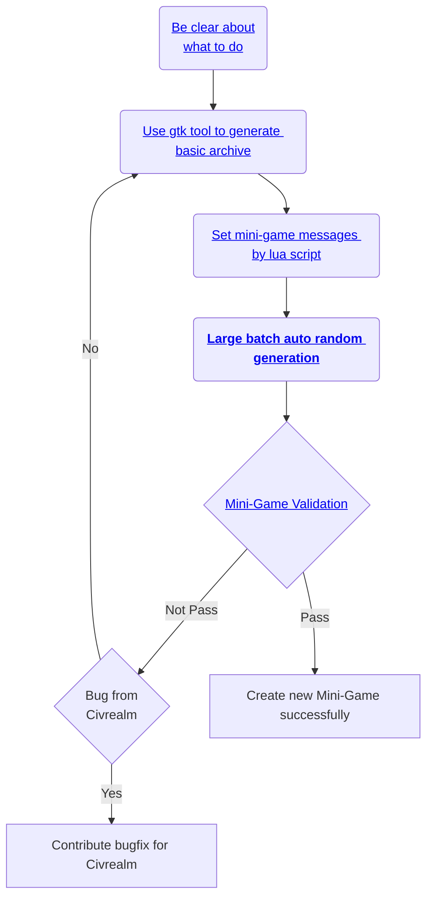
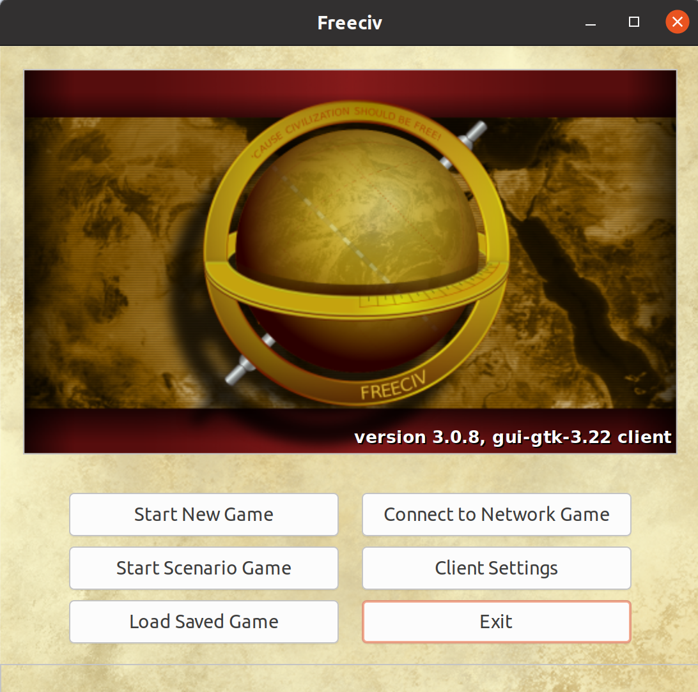

# Create new Mini-Game

The general pipeline of creating new mini-game is as follows:

<div align=center>

</div>

## Be clear about what to do

The basic design mechanisms of mini-game are:

* <b>Single Goal.</b> Don't consider multiple learning objectives at the same time, otherwise the game will become less mini after more influences are introduced.

* <b>Feasible Action.</b> In the huge space of action, be clear about which actions are relevant to your goal, and avoid too many unrelated or paradoxical actions in actionable actions.

* <b>Computable Reward.</b> In addition to the final score at the end of the game, the reward for each step or turn can be defined and calculated.

At the beginning of designing a mini-game, you have to answer the following questions:

* What type of the mini-game do you want to design?

* When does the mini-game end?

* How to calculate the reward for each step?

* How to set the difficulty of the game?

These questions will be given appropriate suggestions to some extent below.

## Use gtk tool to generate basic archive

The tool of freeciv-gtk is provided by freeciv official team to help us design the very basic version of each mini-game. Please follow the instructions in ((<https://github.com/freeciv/freeciv/tree/main/doc>)) to install the tool and run it, specify the game settings and ruleset, which would be like:

<div align="center">
  
  
</div>

After start a new game, use <b>'Edit -> Edit Mode' </b> to design the scenario as you expect and then finish making an initial version of savegame. Save the edited scenario so that you can further edit or load it in the game. After that, you can continue to add messages and generate random maps based on it, which is introduced as followed.

<div align="center">
    
</div>

## Set mini-game messages by lua script

!!! Warning
    <b>Donot modify sav file directly in general.</b> Because the fields in the sav file have dependencies on each other, if you modify a field without noticing some other fields that need to be modified at the same time, it will cause the server to load the sav file unsuccessfully.

The lua script is used to send mini-game messages to the agent. Before adding the lua script for basic sav file, you need to understand the archive format of freeciv and how it defines the game state internally.

* The suffix of the game archive file is `.sav`, and usually compressed as a compressed file with `.xz` or `.zst` suffix. If the archive file is compressed, you need to use the corresponding component to decompress it to get the sav file.

* In the sav file, there are many key-value structures to describe the current game state. Here, We list the main tags and their explanations:

<table>
    <tr>
        <td bgcolor="Lavender"><b>Tag</b></td>
        <td bgcolor="Lavender"><b>Description</b></td>
    </tr>
    <tr>
        <td>savefile</td>
        <td>A set of definition rules for common elements, including activity, technology, etc.</td>
    </tr>
    <tr>
        <td>game</td>
        <td>The base state values of the game, such as turn, launch order and year.</td>
    </tr>
    <tr>
        <td>script</td>
        <td>The script of lua. At the inherent or designed trigger points of the game, obtain the internal data of the game, calculate the custom game state values, and send out event messages.</td>
    </tr>
    <tr>
        <td>settings</td>
        <td>The setting of freeciv server.</td>
    </tr>
    <tr>
        <td>map</td>
        <td>The global map of world, and distribution information of resources, cities, and land development.</td>
    </tr>
    <tr>
        <td>player0</td>
        <td>The game status of a player with an id of 0, including information such as how many units and cities the player0 have. </td>
    </tr>
    <tr>
        <td>score0</td>
        <td>The scores of a player with an id of 0, including information such as total score and unhappy degree.</td>
    </tr>
    <tr>
        <td>research</td>
        <td>The progress of research for each player. </td>
    </tr>
</table>

Here, we focus on the implementation of `script` tag. In the sav file, the format of `script` as below:

```
[script]
code=${lua code}$
```

`{lua code}` is the code of lua language that implements to send mini-game messages.

<b>Firstly</b>, you need to consider which trigger points to set during the game in order to change the status value of the mini-game, and set up the end conditions of the game.
All trigger action functions can be referred to the [Lua Reference manual](https://freeciv.fandom.com/wiki/Lua_reference_manual#Legend). We list the common trigger action functions as follows:

<table>
    <tr>
        <td bgcolor="Lavender"><b>(return) type</b></td>
        <td bgcolor="Lavender"><b>function name/variable</b></td>
        <td bgcolor="Lavender"><b>arguments</b></td>
        <td bgcolor="Lavender"><b>comments</b></td>
    </tr>
    <tr>
        <td>Boolean</td>
        <td>turn_begin</td>
        <td>(Number turn, Number year)</td>
        <td>Trigger at each turn begining.</td>
    </tr>
    <tr>
        <td>Boolean</td>
        <td>city_built</td>
        <td>(City city)</td>
        <td>Trigger at city built.</td>
    </tr>
    <tr>
        <td>Boolean</td>
        <td>unit_lost</td>
        <td>(Unit unit, Player loser, String reason)</td>
        <td>Trigger at unit lost.</td>
    </tr>
    <tr>
        <td>Boolean</td>
        <td>city_destroyed</td>
        <td>(City city, Player loser, Player destroyer)</td>
        <td>Trigger at city destroyed.</td>
    </tr>
</table>

In addition, we developed the following trigger action function to enhance the perception of the freeciv-server game process:

<table>
    <tr>
        <td bgcolor="Lavender"><b>(return) type</b></td>
        <td bgcolor="Lavender"><b>function name/variable</b></td>
        <td bgcolor="Lavender"><b>arguments</b></td>
        <td bgcolor="Lavender"><b>comments</b></td>
    </tr>
    <tr>
        <td>Boolean</td>
        <td>game_started</td>
        <td>(Player player)</td>
        <td>Trigger at game started. The `game_started` supports to display the welcome message at the beginning of the game, if you use the `turn_begin` to set turn=1 to display the welcome message, it will not take effect, because the game thinks that it is already in the current turn running state, and will not trigger the judgment of the `turn_begin`, although this function can be achieved by setting the technique of phase=1 additionally, but the setting will cause other players to act first, which will bring unexpected problems.</td>
    </tr>
    <tr>
        <td>Boolean</td>
        <td>game_ended</td>
        <td>(Player player)</td>
        <td>Trigger at game ended. Since freeciv-server has many internal conditions for ending the game, all the end states of the game can be recycled by using game_ended. If game ended, set mini-game `status`=1(MinitaskGameStatus.MGS_END_GAME).</td>
    </tr>
    <tr>
        <td>Boolean</td>
        <td>action_finished_worker_build</td>
        <td>(City city)</td>
        <td>Trigger at activity finished by worker.</td>
    </tr>
    <tr>
        <td>Boolean</td>
        <td>action_started_worker_build</td>
        <td>(City city)</td>
        <td>Trigger at activity started by worker.</td>
    </tr>
</table>

<b>Secondly</b>, calculate the mini-score and mini-goal.

Taking mini-game `battle` as an example, the formula for calculating the `mini-score` is as follows:

$\text{mini_score}=\text{unit_cnt_of_human_player} - \text{unit_cnt_of_ai_player}$

The larger the mini_score is, the more units of human player survives, the better, and the more units of ai player is destroyed, the better. The `mini-goal` is setting to

$\text{mini_goal}=\text{unit_cnt_of_human_player}$

It means that if you want to satisfy mini_score>=mini_goal to succeed, you need to destroy all units of ai player.

<b>Finally</b>, wrap your message of mini-game and send it out throught E.SCRIPT event. The event function is:

```
notify.event(nil, nil, E.SCRIPT, _(${message}))
```

## Large batch auto random generation

The auto random generation is supported by the `civrealm-sav` module. To implement a new mini-game dependently, you should inherit class `SavTaskGenerator`. For example,

```python
from freeciv_sav.tasks.sav_task import SavTaskGenerator

class NewMiniGameGenerator(SavTaskGenerator):
    def create_new_game(self, lua_conf:str, *args, **kwargs):
        """
        Create new game.

        Parameters
        ----------
        lua_conf : str
            The lua script designed.
        """
        while True:
            {Call the functions from tools to implement randomization}
            break
        return
```

The tools contains `map_op` `unit_op`, `player_op`, `game_op`, etc. The main functions of tools are as follows:

<table>
    <tr>
        <td bgcolor="Lavender"><b>OP</b></td>
        <td bgcolor="Lavender"><b>function name</b></td>
        <td bgcolor="Lavender"><b>comments</b></td>
    </tr>
    <tr>
        <td>map_op</td>
        <td>gen_random_walk_map</td>
        <td>Randomly generate mini-game map by random walk with modifying the terrain, resource and shape of land.</td>
    </tr>
    <tr>
        <td>unit_op</td>
        <td>set_location_with_cluster</td>
        <td>Randomly set location for units.</td>
    </tr>
    <tr>
        <td>player_op</td>
        <td>set_name</td>
        <td>Assignment the name of mini-game.</td>
    </tr>
    <tr>
        <td>game_op</td>
        <td>set_init_status</td>
        <td>Set game status initially.</td>
    </tr>
</table>

Use these functions to help you to implement large batch auto random generation of mini-game.

## Mini-Game Validation

Check your mini-game inside `freeciv-web`, and test the mini-game to follow the section `Play mini-game as a random agent`. If the tests pass, congratulations on completing the task for creating new mini-game.
