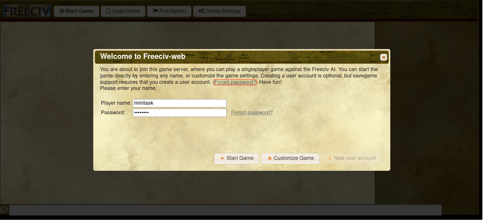
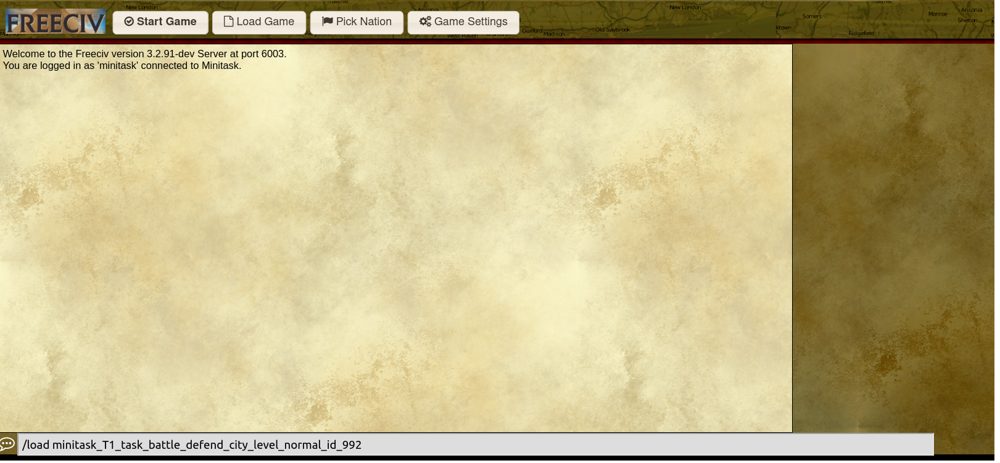

# Mini-Game

Due to the multifaceted aspects of a full game, including economic expansion, military development, diplomatic negotiations, cultural construction, and technological research, we have devised mini games to address each component individually. Each mini-game is designed with specific objectives, varying difficulty levels, step-based rewards, and an overall game score. The designed details could be found in the [paper](https://openreview.net/forum?id=UBVNwD3hPN).

By the end of this tutorial, you will be able to use API to play the mini-game.

## Load Mini-Game by freeciv-web

???- note "Prepare Dataset For Freeciv-web version == 1.3"
    <b>Before you start the mini-game</b>, you need to load the mini-game designed archives into the server’s laoding archive path.

    The steps are as follows:

    <b>Step 1: </b> find your used version on the releases page, and download the data files for the mini-game to your local path such as `/tmp/minigame/`

    <b>Step 2: </b> copy the data files, and extract them into the corresponding docker savegame path. If the docker image is `freeciv-web`, and the tomcat version is `10`, then execute the following commands:

    ```bash
    #!/bin/bash
    image="freeciv-web"
    tomcat_version="tomcat10"
    local_path="/tmp/minigame/"

    mkdir $local_path
    cd $local_path
    docker exec -it $image rm -r /var/lib/$tomcat_version/webapps/data/savegames/minitask/
    docker exec -it $image mkdir -p /var/lib/$tomcat_version/webapps/data/savegames/minitask/
    for minitask_zip in `ls`
    do
        docker cp $minitask_zip $image:/var/lib/$tomcat_version/webapps/data/savegames/minitask/
        docker exec -it $image unzip -o /var/lib/$tomcat_version/webapps/data/savegames/minitask/$minitask_zip -d /var/lib/$tomcat_version/webapps/data/savegames/minitask/
        docker exec -it $image rm /var/lib/$tomcat_version/webapps/data/savegames/minitask/$minitask_zip
    done
    ```

To load the mini-game sav file `MINIGAME_FILE_NAME` by the freeciv-web service, follow these steps:

1. Login by the Player name `minitask`, and click the `Customize Game` button;


2. Enter the command `/load MINIGAME_FILE_NAME` in the input box at the bottom;


3. Click the `Start Game` button to start the mini-game.


## Initialize Random Mini-Game

`civrealm/FreecivMinitask-v0` is the environment of mini-game. When the mini game is launched, its internal design will randomly select a game of any type and any difficulty.

```python
from civrealm.agents import ControllerAgent
import gymnasium

env = gymnasium.make('civrealm/FreecivMinitask-v0')
agent = ControllerAgent()
observations, info = env.reset()
```

## Choose Specific Mini-Game

Inside `reset` method of environment, you can use the parameter `minitask_pattern` to choose specific mini-game. The fields are as follows:

`type`: the type of mini-game, see the available options MinitaskType

`level`: the difficulty of mini-game, see the available options MinitaskDifficulty

`id`: the id of mini-game, the available range is 0 to MAX_ID

For example, if you want to set the type as `development_build_city` and the difficulty as `easy`, then the code is as follows:

```python
from civrealm.agents import ControllerAgent
import gymnasium

env = gymnasium.make("civrealm/FreecivMinitask-v0")
observations, info = env.reset(minitask_pattern={
    "type": "development_build_city", 
    "level": "easy"})
```

## Definition of Mini-game messages

The messages of mini-game are passed from the server to the agent at each trigger point by lua script setting. The general json structure of message is:

```json
{
    "task": "minitask",
    "name": "${name of minitask}",
    "status": ${MinitaskGameStatus},
    "turn": ${turn of game},
    "metrics": [{
        "mini_score": ${mini_score},
        "mini_goal": ${mini_goal},
        "max_turn": ${max_turn},
        "is_mini_success": ${MinitaskPlayerStatus},
    }]
}
```

* The `task` is used to label the source of message. The `task` for messages from mini-game is set to be `minitask`.

* The final element of `metrics` records the final game review status for each trigger action, which is actually used in civrealm. In the dict structure of `metrics` elements, we can  define other useful auxiliary information

* The `metrics.mini_score` is used to record the agent's mini-game score.

* The `metrics.mini_goal` is used to record the agent's mini-game goal, which is to set the game victory score threshold.

* The `metrics.max_turn` is limited to a certain number of turns. If the maximum number of turns is exceeded, failure is returned in civrealm.

* The `metrics.is_mini_success` is used to record the player succeed status of player, which is the same as `success` defined of minitask info in civrealm. If succeed, it requires that `mini_score>=mini_goal`.

## Play mini-game as a random agent

Generally speaking, it is difficult for random agents to win the battle and diplomacy mini-game, and in the development mini-game, the game victory condition will be met with a certain probability.

The commands are as follows:

```bash
cd civrealm/
python src/civrealm/random_game_minitask.py
```

After executing the commands, the log will be like:

!!! success
    ```log
    Step: 0, Turn: 1, Reward: 0.0, Terminated: False, Truncated: False, Action: ('tech', 'cur_player', 'set_tech_goal_Conscription_18')
            Minitask Info: {'status': 0, 'success': -1, 'human_cnt': 11.0, 'ai_cnt': 12.0, 'mini_score': -1.0, 'mini_goal': 11.0, 'max_turn': 50, 'human_leader_alive': 1, 'ai_leader_alive': 1, 'is_mini_success': -1}
    Step: 1, Turn: 1, Reward: 0.0, Terminated: False, Truncated: False, Action: ('unit', 108, 'goto_1')
            Minitask Info: {'status': 0, 'success': -1, 'human_cnt': 11.0, 'ai_cnt': 12.0, 'mini_score': -1.0, 'mini_goal': 11.0, 'max_turn': 50, 'human_leader_alive': 1, 'ai_leader_alive': 1, 'is_mini_success': -1}
    ```

In the log, We can see that each step displays some fields from the above definitions as `Definition of Mini-game messages`, and some are auxiliary fields designed by mini-game itself such as `human_leader_alive`.

## Play mini-game as a AI-assistant agent

!!! warning
    The AI-assistant agent only supports `development_build_city`.

To engage in a dialogue with the rule-based AI assistant integrated within the freeciv server, please configure the following command:
```bash
fc_args['advisor'] = 'enabled'
```

The comprehensive script for invoking the AI assistant within the minigame setting is outlined below:
```python
import time
from civrealm.freeciv.utils.freeciv_logging import fc_logger
from civrealm.envs.freeciv_wrapper import LLMWrapper
from civrealm.configs import fc_args
from civrealm.freeciv.utils.port_utils import Ports
import civrealm
import gymnasium

# enabled AI-assistant
fc_args['advisor'] = 'enabled'

def main():
    env = gymnasium.make('civrealm/FreecivMinitask-v0', client_port=Ports.get())
    step = 0
    observations, info = env.reset(minitask_pattern={
        "type": [
            "development_build_city"]
    })
    done = False
    while not done:
        try:
            # get AI-assistant action
            action = env.civ_controller.get_assistant_action()
            fc_logger.info(f"Prepare to act: {action}")
            # env step
            observations, reward, terminated, truncated, info = env.step(action)
            print(
                f'Step: {step}, Turn: {info["turn"]}, Reward: {reward}, Terminated: {terminated}, '
                f'Truncated: {truncated}, action: {action}')
            step += 1
            done = terminated or truncated
        except Exception as e:
            fc_logger.error(repr(e))
            raise e

    env.close()

if __name__ == '__main__':
    main()

```
