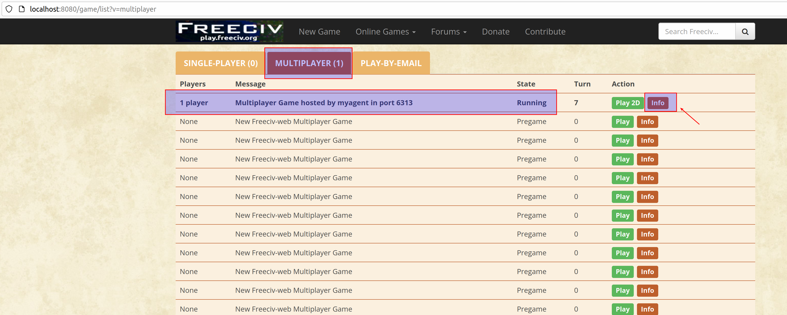
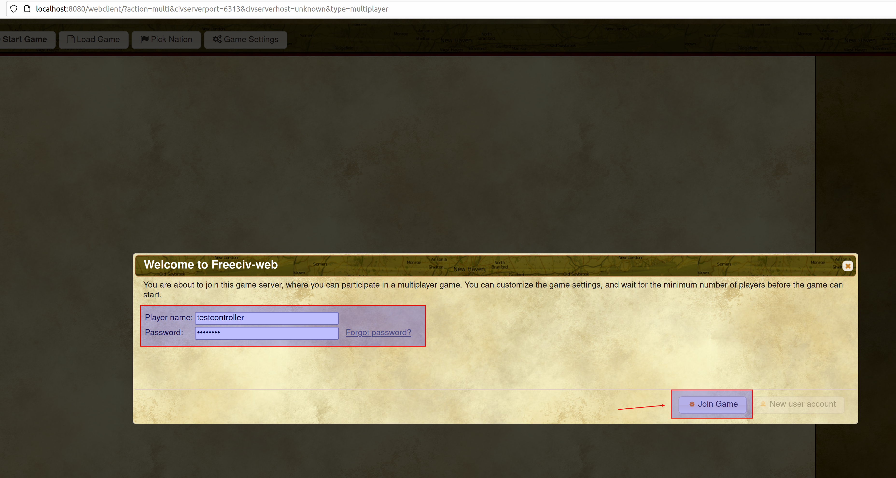
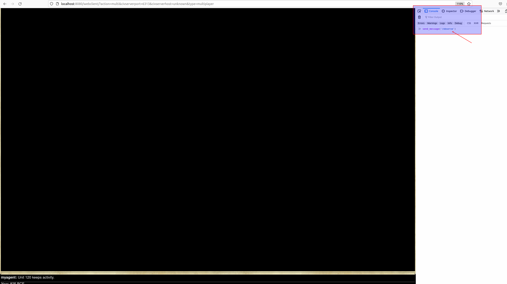
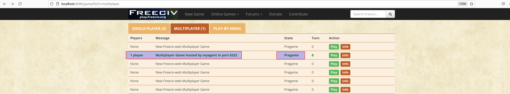
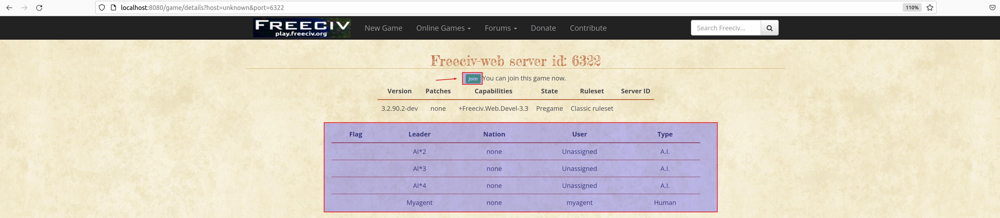
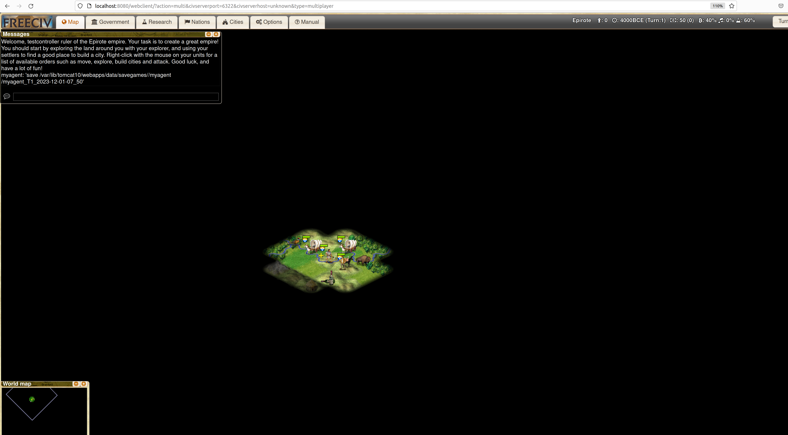
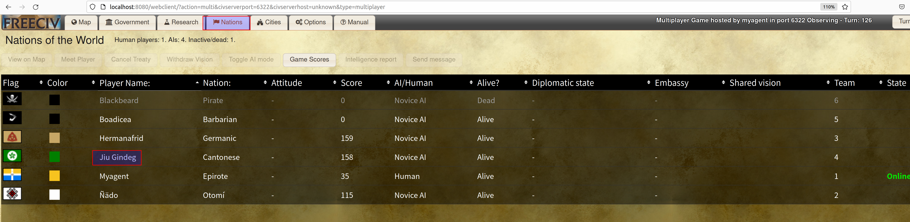

### Testing the installation

To test if the installation is successful, run

```bash
test_civrealm 
```

To test with multiple players, run

```bash
test_civrealm --minp=2 --username=myagent --client_port=6001
```

Then start another terminal and run:

```bash
test_civrealm --username=myagent1 --client_port=6001
```
> :warning:
> Note that to run multiple agents in the same game, you need to make them connect to the same port (specified by client_port). The available client_port range is 6001, 6300~6331.

> :warning:
> Note that when a game finishes on a port, the server on that port will take some time (around 10 seconds) to restart itself. If you start a new game on that port before the server is ready, the program will encounter expected errors and may stop/halt.

To observe the game play, you can access http://localhost:8080/ on a browser. Then, please click the "Online Games" button. You can find the running game under the "MULTIPLAYER" tab as shown below.
<div align="center">
    
</div>
In this page, you can click the "info" button pointed by the arrow and go to the following page.
<div align="center">
    
</div>
In the information page, you can see the name of all players currently playing in the game. Then, you can click the "Join/Observe" button pointed by the arrow to join the game as an observer. In the below, we use "testcontroller" as the username and click the "Join Game" button to join. Note that you may use another username to log in as long as the username is different from the player names that are already used in the game. The password is "civrealm" for all accounts by default.
<div align="center">
    
</div>
Because the game has started before you join, you will see a black screen after you join.
<div align="center">
    
</div>
To observe the game play, you need to send the "observe" command through the console of the explorer. Taking Firefox explorer as an example, you may press "ctrl+shift+I" to start the console. Then, in the console, you can type "send_message("/observe")" to send the command as pointed by the arrow in the above figure. After that, you will be able to observe the game from a global view, i.e., you can see the game play of all players.
<div align="center">
    
</div>
To observe the game play of a certain player, you may type "send_message("/observe PLAYER_NAME")" in the console. In the below, we observe the game play of the player whose player name is "myagent". The command we type is "send_message('/observe myagent')".
<div align="center">
    
</div>

To prevent the game from starting before the observer joins, you can use the "wait_for_observer" configuration to force the game to wait.
```bash
test_civrealm --wait_for_observer=True
```
Then, under the "MULTIPLAYER" tab, you will see the game status is "Pregame". In comparison, the game status will be "Running" if the game has started.
<div align="center">
    
</div>
Similarly, you can click the "Info" button to see the information page.
<div align="center">
    
</div>
You may click the "Join" button to join as an observer by using the "testcontroller" account as before. Note that because the game is waiting, you will see the following pregame page instead of a black screen.
<div align="center">
    
</div>
In this page, you may send the "observe" command in the chatbox instead of the console. As pointed by the arrow, we type "/observe myagent" in the chatbox. After we press "Enter" to send the command, the game will start and we can observe the game play of "myagent".
<div align="center">
    
</div>
Note that you may also send the "observe" command in the chatbox during the game play. As pointed by the arrow in the following page, we can type "/observe" in the chatbox.
<div align="center">
    
</div>
After we send the command, the observation becomes the global view.
<div align="center">
    
</div>
Note that there could be an empty space inside a player name as shown in the below.
<div align="center">
    
</div>
In this case, to observe its game play, you have to send the "observe" command through the console of explorer. Moreover, you need to decorate the empty space inside the player name with ' ' as shown below. Otherwise, the server cannot read the player name correctly. Following this format, the command we type in the console is "send_message("/observe Jiu' 'Gindeg")".
<div align="center">
    
</div>
As shown below, by sending the "observe" command, you will be able to observe the game play of AI player "Jiu Gindeg".
<div align="center">
    
</div>