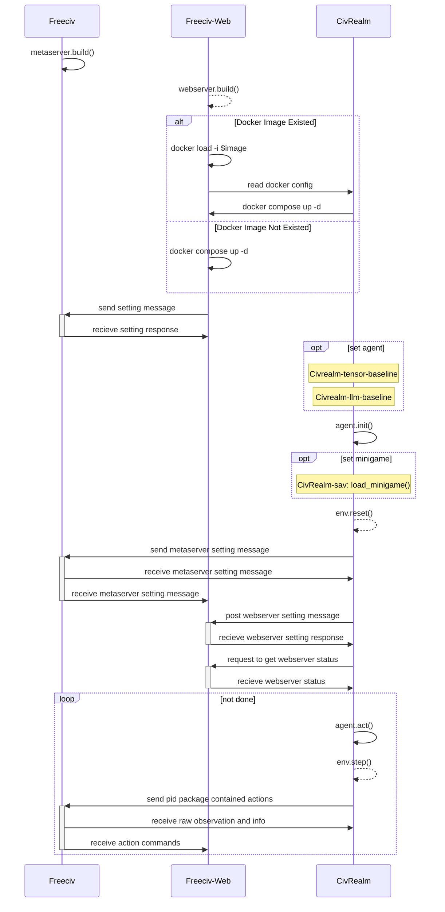

# CivRealm

CivRealm is a reinforcement learning environment for the open-source strategy game [Freeciv-web](https://github.com/freeciv/freeciv-web) based on [Freeciv](https://www.freeciv.org/). The goal is to provide a simple interface for AI researchers to train agents on Freeciv. The interface is based on the [Gymnasium](https://gymnasium.farama.org/) and [Stable Baselines](https://stable-baselines.readthedocs.io/en/master/) framework.

## About

CivRealm is a fork of [freeciv-bot](https://github.com/chris1869/freeciv-bot) that was initiated several years ago and is currently being developed by [BIGAI](https://www.bigai.ai/). Going forward, CivRealm will be maintained in the long term.

## Motivation

Pace of AI research is ever increasing. Recent breakthroughs by AlphaZero, AlphaGo show capabilities of current systems to master "simple" board games via reinforcement learning and Montecarlo tree search (MCTS). OpenAI and Deepmind already start tackling more complex strategy games like Dota 2 and Starcraft 2. The key challenges when switching from board games to strategy games is:

a) Knowledge of state of board is incomplete - therefore information has a cost: Due to fog of war (and unclear worklists, resources) position/status of the enemy and overall map is not fully known - hence risky investments (explorer teams) are required to gain information

b) Number of actors/actions is unlimited: Buildings, Cities, Units can be produced infinitely - hence the data model and learning method for neural networks etc. needs to be more dynamic and will face more sparce option spaces

c) More long-term consequences: In many cases, effect of actions and decisions can only be seen after several rounds, minutes of play. The longer an effect takes to materialize, mapping the actions/decisions to the very effect gets more complicated. Hence, "naive" greedy approaches to improving a single score (e.g., Flipper, Super Mario, etc.) won't cut it.  

On top of these challenges real-time strategy games due their continuous time and space add another layer of complexity (e.g., optimal formation of units, evade balistic projectiles or missiles).

In order to focus on a) b) and c) only, round-based games like Freeciv are a potential intermediate step for developing AI before jumping to real-time strategy games.
